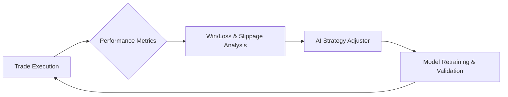

# The AI Learning System

To enable the AI trading system to learn, adapt, and improve its performance over time, we use a continuous feedback loop. This document outlines the key components and processes involved.

### Core Components for Learning

For the AI to analyze and improve, it needs access to several key data sources:

| Data Source | Purpose |
| :--- | :--- |
| **Exchange APIs** (Binance, Bybit) | Real-time price data, order execution history. |
| **On-Chain Data** (Etherscan) | Wallet tracking, smart contract events. |
| **Market Intelligence** (Glassnode) | Market sentiment, liquidity data, on-chain analytics. |
| **News/Sentiment APIs** (CryptoPanic) | Event detection and news-driven sentiment analysis. |

### The Feedback Loop

The core of the learning process is a cycle where the results of past trades are used to improve future decisions.



This loop consists of:
Trade Execution: A trade is made based on the current AI model.
Performance Metrics: The outcome of the trade (profit, loss, slippage, fees) is recorded.
Analysis: The system analyzes why the trade succeeded or failed, considering the market conditions at the time.
Strategy Adjustment: The AI model proposes adjustments to its internal parameters or rules.
Retraining: The model is retrained with the new data and validated against historical data before being deployed.
Reinforcement Learning Parameters
To guide its learning, the AI uses a set of high-level goals and risk parameters. These act as its "personality" and strategic objectives.

```mermaid
{
  "risk_parameters": {
    "max_drawdown_percent": 15,
    "daily_loss_limit_percent": 5
  },
  "learning_goals": {
    "target_sharpe_ratio": 2.5,
    "win_rate_improvement_goal": "5% quarterly"
  },
  "personality_profile": {
    "trading_style": "swing_trader",
    "fomo_resistance": "medium"
  }
}
```

By providing these elements, the AI can learn your historical decision patterns, adapt to your risk tolerance, and continuously refine its strategies to discover new market opportunities.
code.
