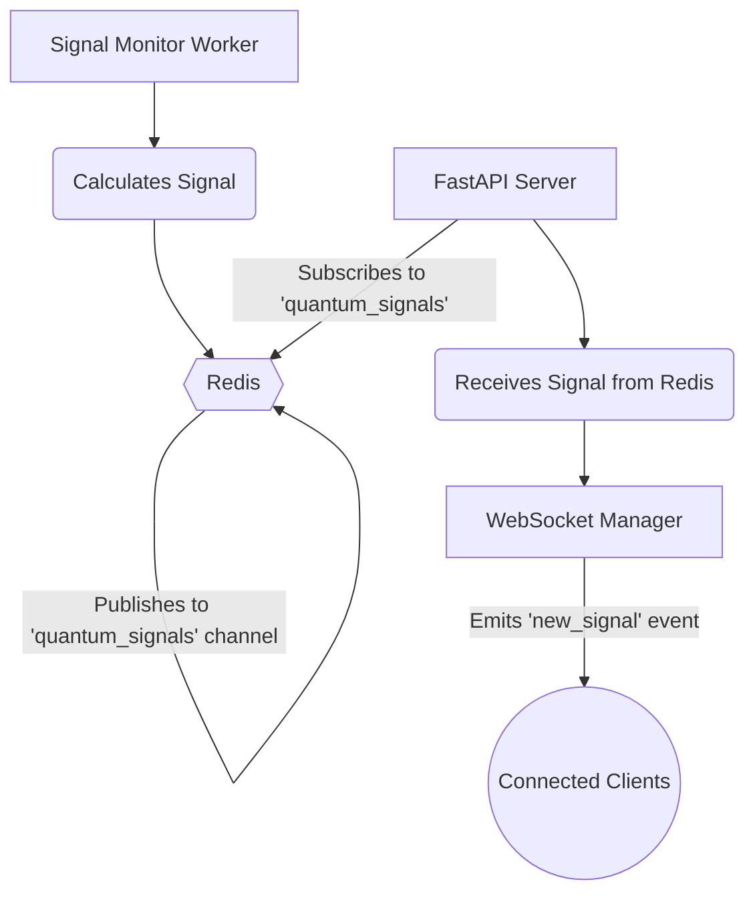

# Redis Pub/Sub Architecture

This document outlines the use of Redis Pub/Sub as the central message bus for the backend. This architecture allows for a decoupled system where different services can communicate asynchronously.

**Audience:** You (Infrastructure), Gemini (Implementation)
**Goal:** To define the channels and data flow for inter-service communication.

---

### Core Concept

The system uses a **Publish-Subscribe** pattern.

*   **Publishers:** Services that generate data (like the `signal_monitor.py` worker) will "publish" messages to a specific Redis channel. They don't know or care who is listening.
*   **Subscribers:** Services that need to react to data (like the main FastAPI server) will "subscribe" to those channels and listen for messages.

This prevents the web server from being blocked by long-running tasks like constantly polling a market data API.

### High-Level Data Flow



Implementation Details
1. The Publisher (signal_monitor.py)
The background worker is responsible for publishing new signals.
Library: Standard redis-py library.
Action:
Connect to the Redis instance.
In a loop, fetch market data and calculate signals.
If a new signal is found, serialize the signal data to a JSON string.
Use the r.publish('quantum_signals', json_string) command to send the data to the quantum_signals channel.
Example Code Snippet:

```mermaid
# In app/workers/signal_monitor.py
import redis
import json
import time

r = redis.Redis.from_url(os.getenv("REDIS_URL"))

def monitor_market():
    while True:
        # ... logic to calculate signal ...
        if new_signal_found:
            signal_data = { "type": "BUY", "price": 60000 }
            r.publish('quantum_signals', json.dumps(signal_data))
            print("Published signal to Redis.")
        time.sleep(60)
```

2. The Subscriber (FastAPI main.py)
The main web application will listen for these messages in a background task.
Library: redis.asyncio to work seamlessly with FastAPI's async nature.
Action:
On application startup (@app.on_event("startup")), create a background task that runs a listener function.
The listener function subscribes to the quantum_signals channel.
It enters an infinite loop, waiting for messages.
When a message is received, it deserializes the JSON data.
It then calls the WebSocket manager (sio.emit) to broadcast the data to all connected clients.
Example Code Snippet:

```mermaid
# In main.py
import asyncio
import redis.asyncio as redis

redis_client = redis.from_url(os.getenv("REDIS_URL"))

async def redis_listener():
    pubsub = redis_client.pubsub()
    await pubsub.subscribe('quantum_signals')
    while True:
        message = await pubsub.get_message(ignore_subscribe_messages=True)
        if message:
            signal_data = json.loads(message['data'])
            await sio.emit('new_signal', signal_data) # sio is the websocket manager

@app.on_event("startup")
async def startup_event():
    asyncio.create_task(redis_listener())
```
