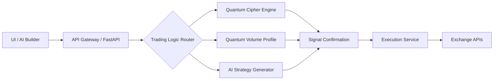

# System Architecture

This document provides a high-level overview of the Quantum Trader Pro architecture, its core components, and the technology stack.

### Core Philosophy: A Hybrid Approach

The system is built on a hybrid model that balances speed of development with granular control over critical components:

*   **AI Builders for UI & Admin:** A platform like Dify.ai or Bubble can be used to rapidly develop the user interface, dashboards, and administrative panels. This handles 80% of the standard web application features.
*   **Custom Python Backend for Trading Logic:** The core trading engine, signal processing, and AI strategy generation are written in custom Python to ensure maximum performance, control, and flexibility.

This approach allows for a fast, iterative development cycle for the user-facing parts of the app while reserving deep, custom engineering for the mission-critical trading core.

### High-Level Flow

The data and command flow through the system is designed to be decoupled and scalable.



Technology Stack
The system leverages a modern, robust set of tools and services, categorized by their function.
🧠 AI & Prompt Engineering
Gemini Build (Google AI): AI copilot for building the application.
LLM APIs (Gemini, Mixtral): Used for conversational assistance and strategy generation.
LangChain: The framework for building and orchestrating AI agents.
💻 Backend & Development
FastAPI: High-performance Python framework for the API backend.
Redis: In-memory data store for caching and real-time Pub/Sub messaging.
Socket.IO: Enables real-time, bidirectional communication with the frontend.
Docker / Docker Compose: Containerizes all services for a reproducible and scalable environment.
GitHub Codespaces: Cloud-based development environment.
⚛️ Frontend
React: The primary UI framework for building interactive components.
Vite or Next.js: Modern frontend tooling for building and serving the UI.
📊 Data & Infrastructure
TimescaleDB: A time-series database (PostgreSQL extension) for storing market data.
Kafka (Optional): Can be added later as a scalable message bus for high-throughput data pipelines.


5.  Click **"Commit changes"**.

---

### Step 2: Enable Mermaid Diagrams in `mkdocs.yml`

Now, let's update the config file to render that diagram.

1.  On GitHub, go to the `mkdocs.yml` file and click the **Edit** icon.
2.  **Delete everything inside** and replace it with this final, complete version.

```yaml
site_name: Quantum Trader Pro Docs
theme:
  name: material
  features:
    - navigation.tabs
    - navigation.sections
    - content.code.copy
    - content.code.annotate

markdown_extensions:
  - admonition
  - pymdownx.details
  - pymdownx.superfences:
      custom_fences:
        - name: mermaid
          class: mermaid
          format: !!python/name:pymdownx.superfences.fence_code_format
  - attr_list

nav:
  - 'Home': index.md
  - 'Get Started':
    - 'Quickstart': getting-started.md
    - 'Configuration': configuration.md
  - 'Tutorials':
    - 'Real-Time Setup': tutorials/real-time-setup.md
  - 'Conceptual Guides':
    - 'System Architecture': concepts/system-architecture.md
    - 'AI Learning System': concepts/ai-learning-system.md
  - 'API Reference':
    - 'Quantum Cipher': reference/quantum-cipher.md
    - 'Quantum Volume Profile': reference/quantum-volume-profile.md
```
